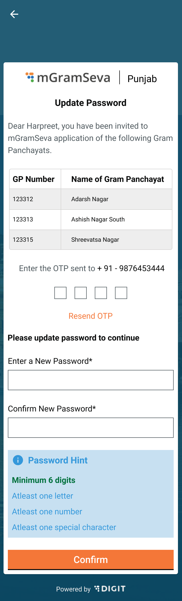

# Application Permissions & Dependencies

Make sure the below-mentioned permissions are allowed or accepted:

1. Internet access
2. FileStore read and write
3. Bluetooth connection
4. Request packages
5. Query all packages

## **Code Snippet**

```
<uses-permission android:name="android.permission.INTERNET"/>
<uses-permission android:name="android.permission.WRITE_EXTERNAL_STORAGE"></uses-permission>
<uses-permission android:name="android.permission.READ_EXTERNAL_STORAGE"></uses-permission>
<uses-permission android:name="android.permission.REQUEST_INSTALL_PACKAGES" />
<uses-permission android:name="android.permission.QUERY_ALL_PACKAGES"/>
```

[punjab-mgramseva/pubspec.yaml at develop · egovernments/punjab-mgramseva](https://github.com/egovernments/punjab-mgramseva/blob/develop/frontend/mgramseva/pubspec.yaml)

## Steps To Setup The Project  <a href="#steps-to-setup-the-project" id="steps-to-setup-the-project"></a>

Download the flutter sdk [2.8.1](https://storage.googleapis.com/flutter\_infra\_release/releases/stable/windows/flutter\_windows\_2.8.1-stable.zip) from [Flutter SDK releases](https://docs.flutter.dev/development/tools/sdk/releases)

Install [Android Studio](https://developer.android.com/studio?gclid=Cj0KCQiAoNWOBhCwARIsAAiHnEhdk4OIpKE17YONk6ivWbnEFDrc5RKLxJpYQldYx2v6E714Lb5W-jEaAnTHEALw\_wcB\&gclsrc=aw.ds) for setting the IDE.

Open Android Studio. Open plugin preferences (**File > Settings > Plugins**) and select **Marketplace.** Select the Flutter plugin and click **Install** as shown in the image below. Click **Yes** when prompted to install the Dart plugin.

.png>)

Set the Flutter SDK path in android studio by navigating to (**File > Settings > Plugins > Language & Frameworks >>flutter**) flutter as shown in the image below.

.png>)

Add the flutter path to the system path variable for running the flutter commands as shown in the image below.

.png>)

Open a new terminal and run the **flutter doctor** command. This downloads the respective Dart SDK version and runs **flutter doctor--android-licenses** to accept the android licenses.

The steps below guide us to run the project on both Web and Mobile\
1\. Clone the project from the [Git repo](https://github.com/misdwss/punjab-mgramseva).\
2\. Open the project in android studio by selecting (**File > open**), select the flutter project (punjab-mgramseva/frontend/mgramseva) from the cloned path as shown in the image below.

.png>)

## **Running On Android Emulator**

Select the AVD manager from the right-side top corner as shown in the image. Now, select any device by tapping on the play button. The Android Studio launches the emulator and the device is auto-selected. There are two modes for running the application - play and debug. Tap on any one of the modes to launch the mGramSeva application in the emulator as shown in the image.

.png>)

## **Running On Web**

Select the chrome option from the device selection and tap on the play button. This launches the application on a chrome window.

<mark style="background-color:blue;">Note: To resolve the cors error follow the steps provided</mark> <mark style="background-color:blue;"></mark><mark style="background-color:blue;">****</mark> <mark style="background-color:blue;"></mark><mark style="background-color:blue;">in this</mark> [<mark style="background-color:blue;">link.</mark>](https://stackoverflow.com/questions/65630743/how-to-solve-flutter-web-api-cors-error-only-with-dart-code)\


## **Build Prod App Bundle - Steps**

1. &#x20;Clone the Repo → git clone [GitHub - misdwss/punjab-mgramseva](https://github.com/misdwss/punjab-mgramseva.git)
2. Navigate to mgramseva folder → cd punjab-mgramseva/frontend/mgramseva
3.  Upgrade the version in the [pubspec.yml](https://github.com/misdwss/punjab-mgramseva/blob/master/frontend/mgramseva/pubspec.yaml) (version: 1.0.2+3)\
    1.0.2 => version name (which is displayed in play store)

    \+3 => version code (increment by +1 every time)
4. Replace the base Url with Prod Url\
   File → [app.config.dart](https://github.com/misdwss/punjab-mgramseva/blob/master/frontend/mgramseva/lib/Env/app\_config.dart)\
   \_baseUrl: window.location.origin + "/", =>    \_baseUrl:  "[mgramseva](https://mgramseva-dwss.punjab.gov.in/) "
5. Comment the below line\
   File → [link](https://github.com/misdwss/punjab-mgramseva/blob/master/frontend/mgramseva/lib/components/HouseConnectionandBill/jsconnnector.dart)\
   export 'dart:js' show allowInterop, allowInteropCaptureThis;
6. Execute the flutter clean command →    **flutter clean**
7. Execute the flutter pub get command →  **flutter pub get**
8. Download the key-store from the below link \
   [https://drive.google.com/file/d/14teTA0nqHaFLEkgg\_LCHTcji5cRJDnXR/view?usp=sharing - Restricted link, try another account](https://drive.google.com/file/d/14teTA0nqHaFLEkgg\_LCHTcji5cRJDnXR/view?usp=sharing)\
   Add this properties file to the android app folder as shown in the image below -\
   **android → key.properties** ****
9. Download the google service json from the link below\
   [google-services.json](https://drive.google.com/file/d/1USBY0a2sluHh2VwWxVcKhR7nzjkYnAmW/view?usp=sharing)\
   Add this json file to the android app folder as shown in the image below\
   **android → app → google-services.json** .png>)****
10. Build the prod app bundle → **flutter build appbundle**\
    Check the attached drive link below which includes the key-store, and version tracker. Update the version and release date in the sheet.\
    Path → **D:\mgramseva\_prod\punjab-mgramseva\frontend\mgramseva\build\app\outputs\bundle\release\app-release.aab**\
    [https://docs.google.com/spreadsheets/d/1aH596FxtPISIlQzxw9jO\_Ex1dttpJJvweib2F9nJj9o/edit#gid=0 - Restricted link, try another account](https://docs.google.com/spreadsheets/d/1aH596FxtPISIlQzxw9jO\_Ex1dttpJJvweib2F9nJj9o/edit#gid=0)

## **Steps To Run The Integration Test On Android Device**

1\. Enable the USB debugging option on your Mobile Phone. ([Reference Link](https://www.howtogeek.com/129728/how-to-access-the-developer-options-menu-and-enable-usb-debugging-on-android-4.2/) )

2\. Connect your Phone to the system and enable File transfer.

3\. Select the AVD manager(your Phone) from the right side top corner in Android Studio

4\. Go to the frontend/mgramseva/utils/execute\_integration.sh file and run it.

5\. Integration test will start on your device.

